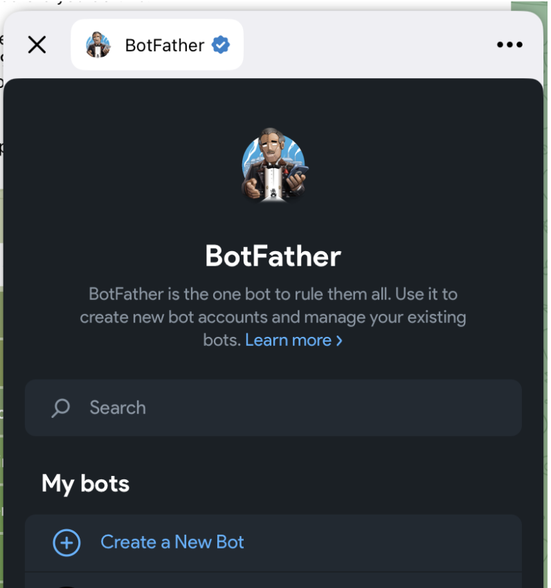
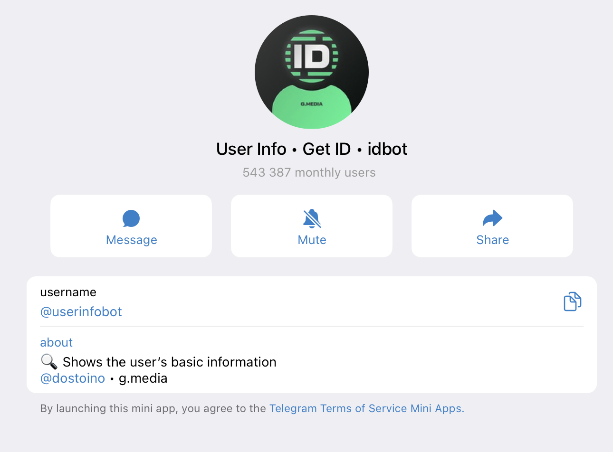
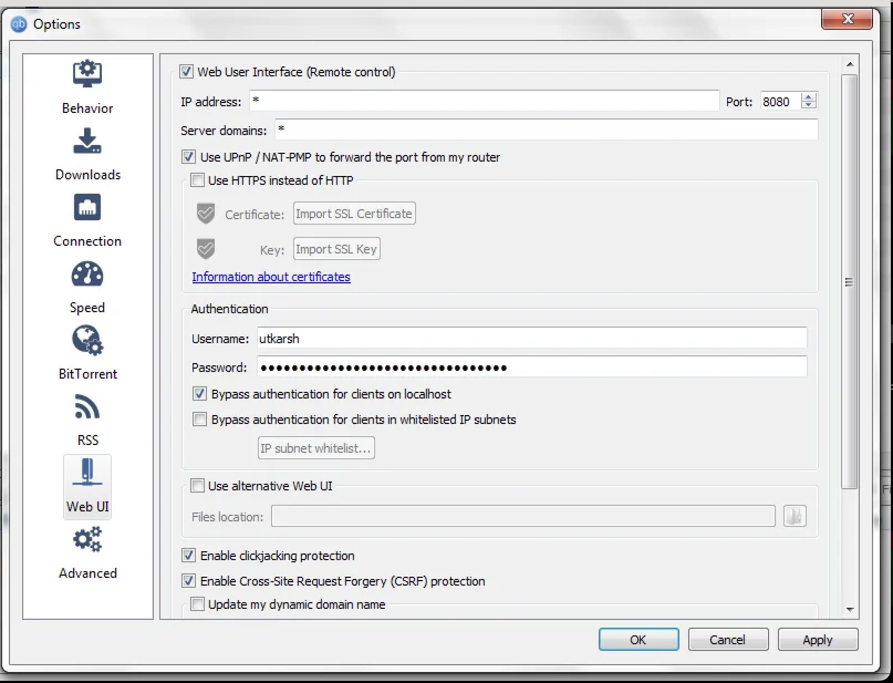

# tt-bot

A stateless Telegram bot for managing qBittorrent downloads.

## Features

- **Add torrents** — send magnet links or `.torrent` files
- **Category selection** — pick a qBittorrent category via inline keyboard before adding
- **List torrents** — paginated views: all, active, downloading, or uploading
- **Torrent detail view** — size, progress, speeds, uploaded amount, ratio, category
- **Torrent file management** — view files within a torrent, change download priorities (Skip/Normal/High/Maximum)
- **Torrent control** — pause, resume, and remove torrents with confirmation
- **Human-readable statuses** — qBittorrent states mapped to emoji labels (e.g. `stalledDL` → `⬇️ Downloading (stalled)`)
- **Completion notifications** — get notified when a download finishes
- **Access control** — whitelist Telegram users by numeric ID

## Prerequisites

- **Go 1.22+** — required only if building from source
- **Docker & Docker Compose** — for the recommended Docker setup (includes qBittorrent)
- **A Telegram bot token** — from [@BotFather](https://t.me/BotFather) (see [Step 1](#step-1-create-a-telegram-bot))
- **A running qBittorrent instance** with **WebUI enabled** and **login credentials configured** (see [Step 3](#step-3-set-up-qbittorrent)) — not needed if using Docker Compose

## Setup Guide

### Step 1: Create a Telegram Bot

1. Open [@BotFather](https://t.me/BotFather) in Telegram.
2. Send `/newbot` and follow the prompts to choose a name and username.
3. Copy the **bot token** BotFather gives you — you'll need it for configuration.

<p align="center">
  
</p>

> **Note:** The bot auto-registers its commands with Telegram on startup via `setMyCommands`. You don't need to configure them manually in BotFather.

### Step 2: Get Your Telegram User ID

The bot uses a whitelist of numeric Telegram user IDs. Usernames are **not** supported — you need your numeric ID.

**How to find it:**

1. Open Telegram and search for [@userinfobot](https://t.me/userinfobot).
2. Send it any message (or just `/start`).
3. It replies with your numeric user ID (e.g., `123456789`).

Alternatively, use [@raw_data_bot](https://t.me/raw_data_bot) — forward any message to it and it will show the sender's user ID.

<p align="center">
  
</p>

### Step 3: Set Up qBittorrent

> **Skip this step if using Docker Compose** — it includes qBittorrent automatically.

1. Install qBittorrent from [qbittorrent.org](https://www.qbittorrent.org/download).
2. Open qBittorrent and go to **Tools > Options > Web UI** (or **Preferences > Web UI** on macOS).
3. Check **"Web User Interface (Remote control)"** to enable the WebUI.
4. Set a **username** and **password** — these become your `QBITTORRENT_USERNAME` and `QBITTORRENT_PASSWORD` env vars.
5. Note the listening port (default: `8080`). Your `QBITTORRENT_URL` will be `http://localhost:8080`.

<p align="center">
  
</p>

### Step 4: Configure Environment Variables

Copy the example file and fill in your values:

```bash
cp .env.example .env
```

Edit `.env` with your details:

| Variable | Required | Description |
|----------|----------|-------------|
| `TELEGRAM_BOT_TOKEN` | Yes | Bot token from @BotFather ([Step 1](#step-1-create-a-telegram-bot)) |
| `TELEGRAM_ALLOWED_USERS` | Yes | Comma-separated numeric Telegram user IDs ([Step 2](#step-2-get-your-telegram-user-id)) |
| `QBITTORRENT_URL` | Yes | WebUI URL, e.g. `http://localhost:8080` |
| `QBITTORRENT_USERNAME` | Yes | WebUI username configured in qBittorrent |
| `QBITTORRENT_PASSWORD` | Yes | WebUI password configured in qBittorrent |
| `POLL_INTERVAL` | No | How often to check for completed downloads (default: `30s`) |

> When using Docker Compose, `QBITTORRENT_URL` is overridden to `http://qbittorrent:8080` automatically.

## Running the Bot

### Option A: Docker Compose (Recommended)

The easiest way to run everything — includes both qBittorrent and the bot:

```bash
docker compose up --build
```

This starts qBittorrent and the bot in containers connected via Docker's internal network. No separate qBittorrent installation needed.

### Option B: Build and Run Locally

#### Linux

```bash
# Install Go 1.22+ (https://go.dev/doc/install)
# Download and extract the archive, then add to PATH

# Clone and build
git clone https://github.com/yourusername/tt-bot.git
cd tt-bot
go build -o tt-bot ./cmd/bot

# Load environment variables
set -a && source .env && set +a

# Run
./tt-bot
```

#### macOS

```bash
# Install Go via Homebrew
brew install go

# Clone and build
git clone https://github.com/yourusername/tt-bot.git
cd tt-bot
go build -o tt-bot ./cmd/bot

# Load environment variables
set -a && source .env && set +a

# Run
./tt-bot
```

#### Windows (PowerShell)

```powershell
# Install Go from https://go.dev/dl/ (use the MSI installer)

# Clone and build
git clone https://github.com/yourusername/tt-bot.git
cd tt-bot
go build -o tt-bot.exe ./cmd/bot

# Load environment variables from .env
Get-Content .env | ForEach-Object {
    if ($_ -match '^\s*([^#][^=]+)=(.*)$') {
        [System.Environment]::SetEnvironmentVariable($Matches[1].Trim(), $Matches[2].Trim(), 'Process')
    }
}

# Run
.\tt-bot.exe
```

## Bot Commands and Usage

### Commands

| Command | Description |
|---------|-------------|
| `/list` | List all torrents with pagination |
| `/active` | List active transfers (downloading + seeding) |
| `/downloading` | List incomplete torrents (paused + active) |
| `/uploading` | List completed torrents (seeding, paused seeds) |
| `/help` | Show available commands and usage |

### Adding Torrents

- **Magnet link** — paste a magnet URI into the chat. The bot prompts you to select a category, then adds the torrent.
- **`.torrent` file** — send a `.torrent` file as a document. Same category selection flow as magnet links.

### Torrent Detail View

Select any torrent from a list to see its detail view with:
- Name, size, progress bar, download/upload speeds
- Uploaded amount and share ratio
- Human-readable status with emoji (e.g. `🌱 Seeding`, `⏸️ Paused (Downloading)`)
- Category

### Torrent Controls

From the detail view:
- **⏸ Pause / ▶️ Start** — pause or resume the torrent
- **🗑 Remove** — remove with confirmation (keep files or delete files)
- **📁 Files** — view and manage individual files

### File Management

From the files view:
- See each file's name, size, progress, and download priority
- Change priority per file: **Skip**, **Normal**, **High**, **Maximum**
- Paginated for torrents with many files (5 per page)

### Completion Notifications

The bot polls qBittorrent at a configurable interval (default: 30 seconds) and sends you a message when a download completes. This runs automatically in the background.

## Development

### Make Targets

```bash
make build            # go build ./...
make lint             # golangci-lint run
make test             # Unit tests with coverage (go test ./... -short -cover)
make test-integration # Integration + E2E tests in Docker (spins up qBittorrent)
make gate-all         # Full quality gate: build → lint → unit tests
make clean            # Remove coverage.out and bot binary
```

### Running a Single Test

```bash
go test ./internal/qbt/ -run TestLogin -short -v
```

### Architecture

```
cmd/bot/main.go        Entry point — wires everything, runs Telegram long-polling
internal/config/       Environment variable loading and validation
internal/qbt/          qBittorrent Web API v2 client (interface + HTTP implementation)
internal/bot/          Telegram update dispatcher, auth, callbacks, pending state
internal/formatter/    Message formatting within Telegram limits, pagination keyboards
internal/poller/       Background goroutine detecting completed downloads
```

### Key Design Decisions

- **Stateless** — all state is in-memory and lost on restart (by design)
- **Interface-driven** — `qbt.Client`, `bot.Sender`, `poller.Notifier` for testability
- **Telegram-safe** — messages stay under 4096 chars, callback data under 64 bytes

### Test Coverage

| Package | Coverage |
|---------|----------|
| config | 91.3% |
| formatter | 97.3% |
| poller | 88.2% |
| bot | 82.6% |
| qbt | 80.8% |
